# Hate-Speech-Detection-In-Social-Media
Task description: Inspired by the OLID dataset for English, researchers released a similar dataset for Hingligh and Hindi tweets as well. For this project, we will focus on 2021's HASOC Subtask A. It is also a binary classification.
The task is to classify the tweets as HOF{Hate-Offensive tweets) or NOT{Not-Hate-Offensive) tweets.

 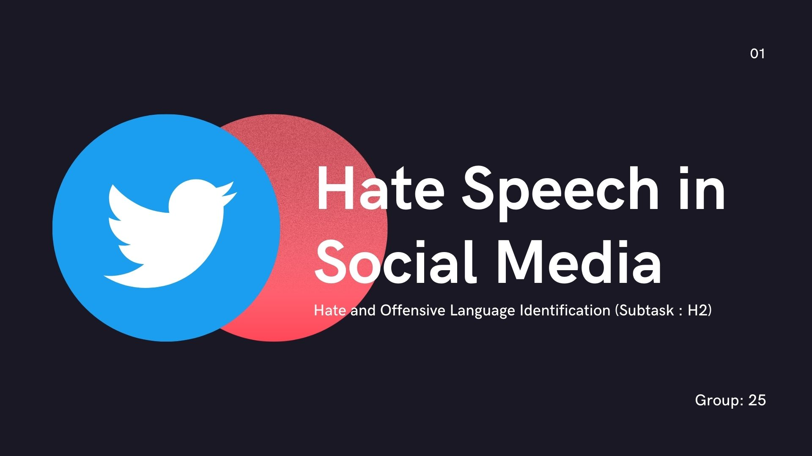
 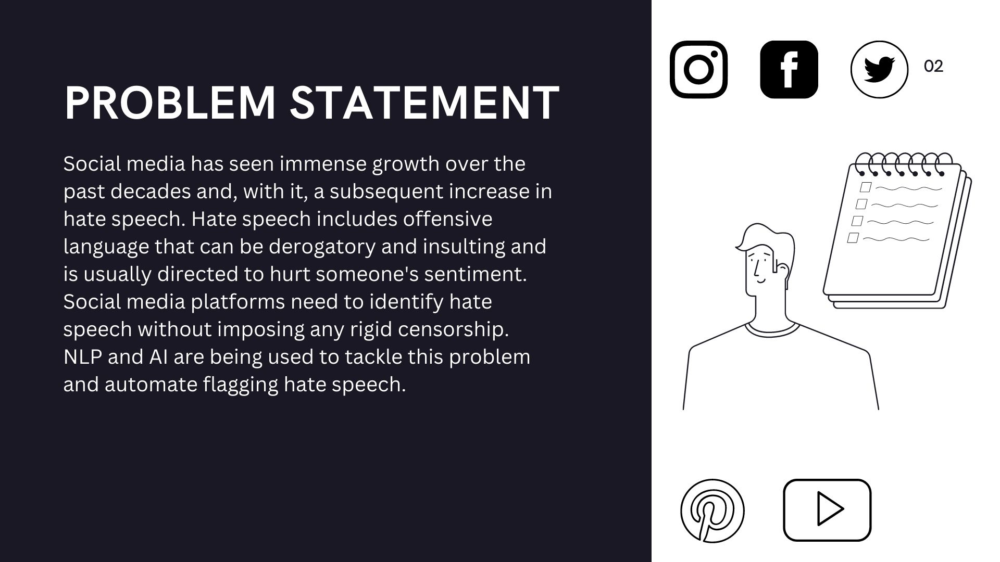
 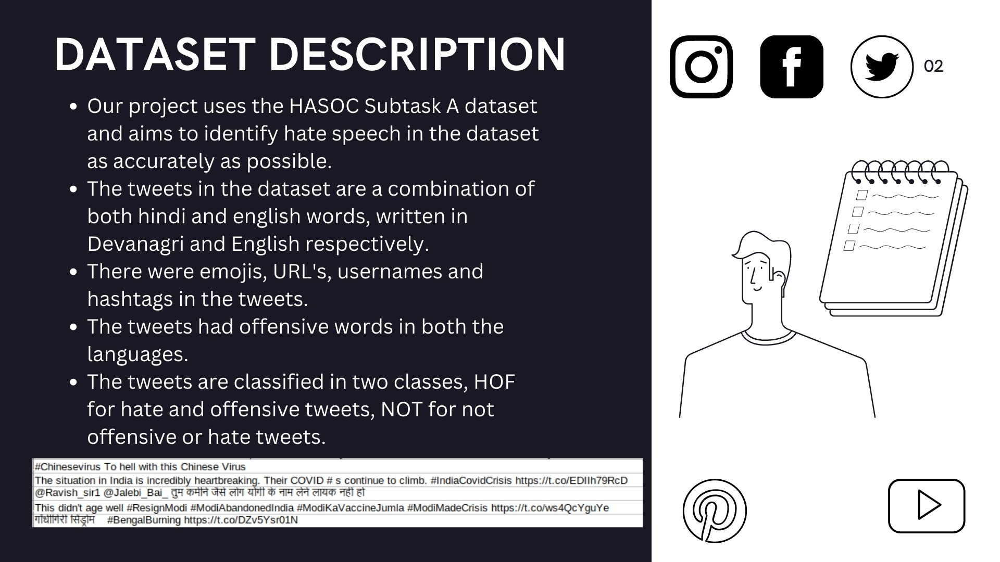
 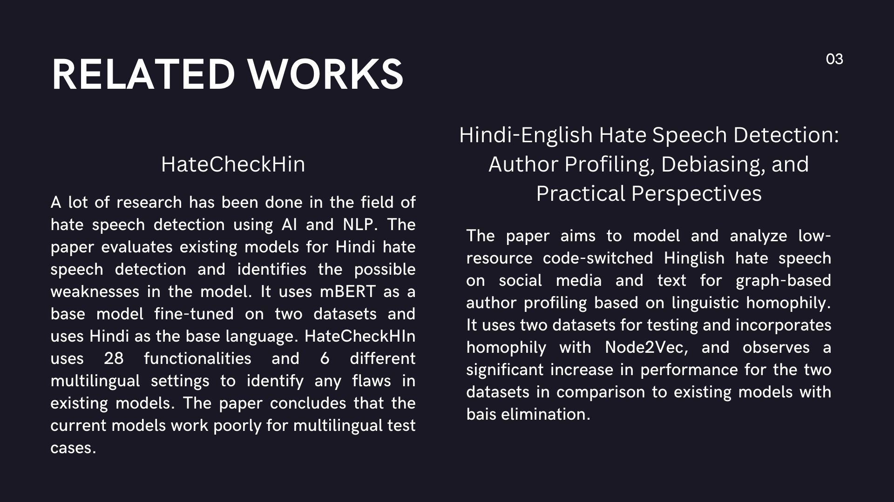
 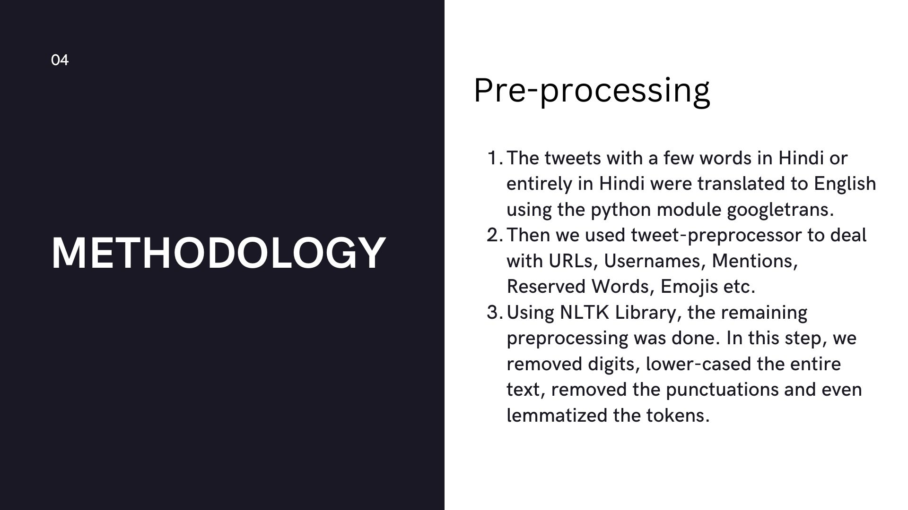
 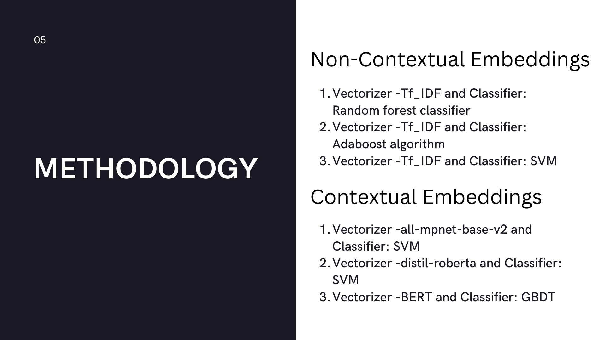
 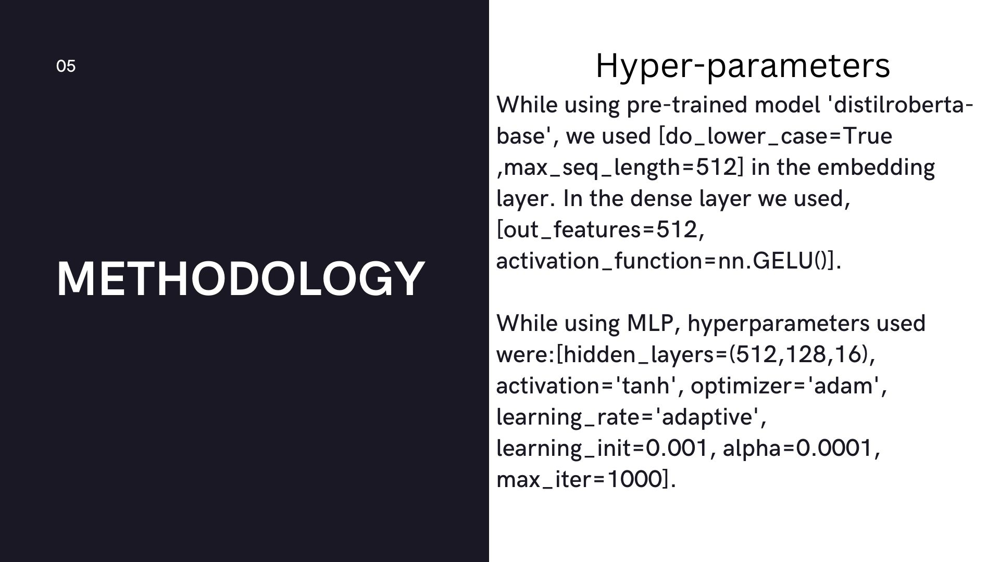
 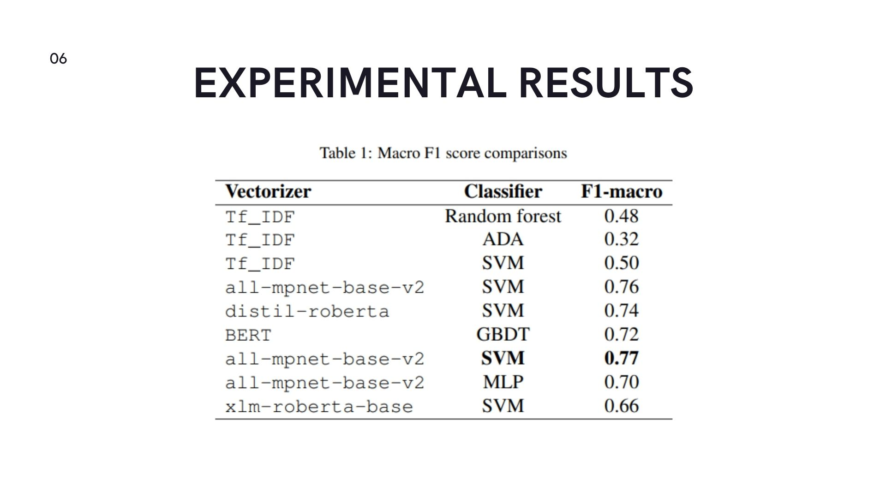
 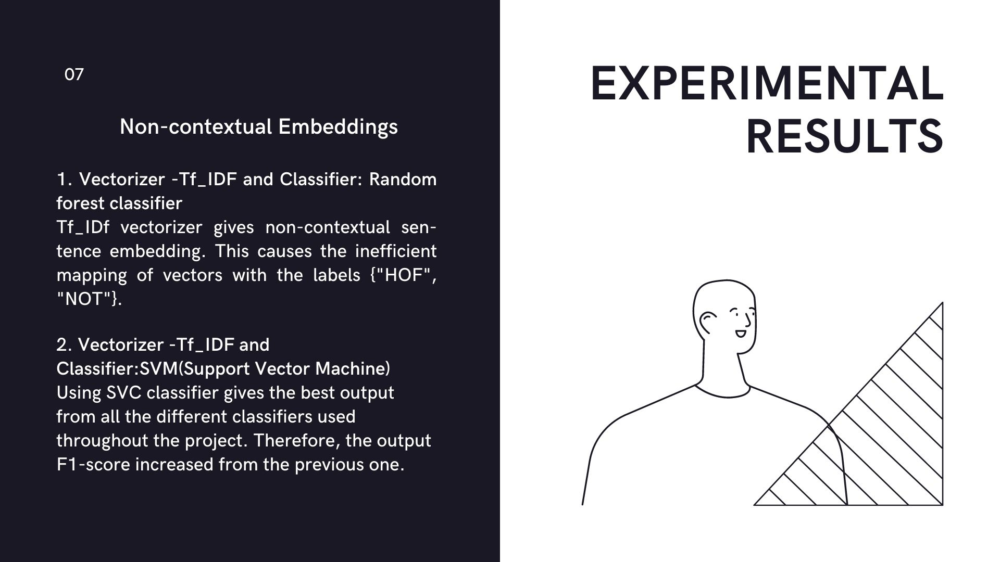
 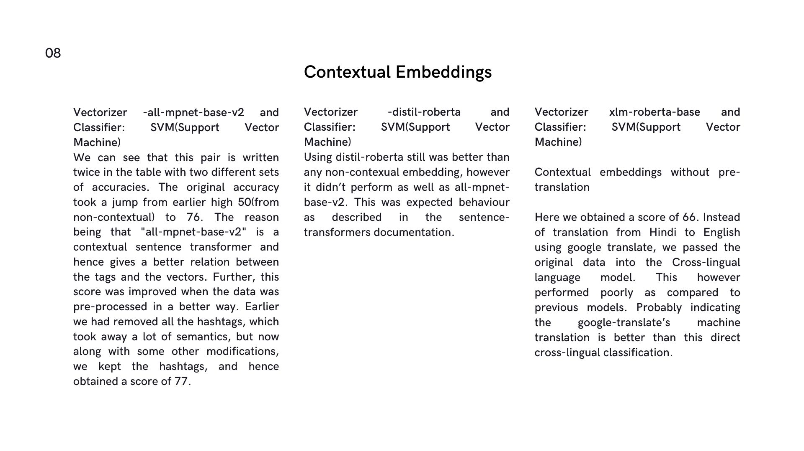
 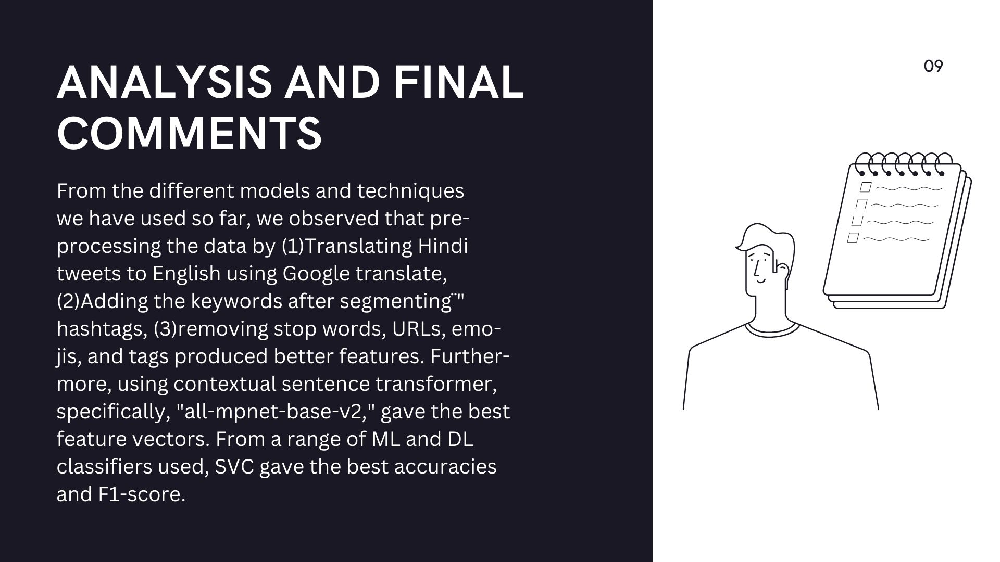

